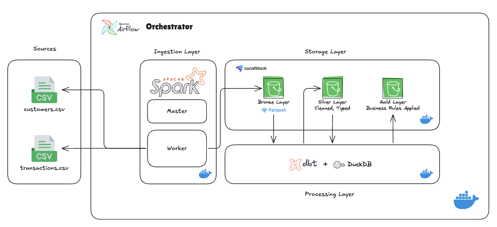

# Data Lake Project with Medallion Architecture
Local Data Lake demonstrating Medallion Architecture (Bronze/Silver/Gold) with Spark, dbt, Airflow and LocalStack S3.

## Architecture


## Technologies
- Docker Compose (6 Services)
- Apache Spark 3.5
- Apache Airflow 2.11.2
- dbt Core + dbt-duckdb
- DuckDB
- LocalStack (S3)
- Python 3.11

## Quick Start
```bash
git clone https://github.com/Lima-Developer/data_lake_medallion.git
docker compose up -d
# Trigger DAG at http://localhost:8080
```

## Services
- Airflow UI: http://localhost:8080
  - username: airflow
  - password: airflow
- Spark UI: http://localhost:8081
- LocalStack S3: http://localhost:4566

## dbt Docs (Catálogo de Tabelas)

Após a execução do pipeline, o dbt gera uma documentação interativa com o catálogo de todas as tabelas (Silver e Gold), descrições das colunas, testes e o grafo de linhagem.

Para acessar:

```bash
python3 -m http.server 8085 --directory dbt/lake/target
```

Acesse em: http://localhost:8085


### Troubleshooting
> **All Containers are Up, why I can not access the Airflow UI?**
> This is normal, the Airflow UI take a few minutes to be up. So after a few seconds, just refresh the page and try again to Sign In in the UI.
